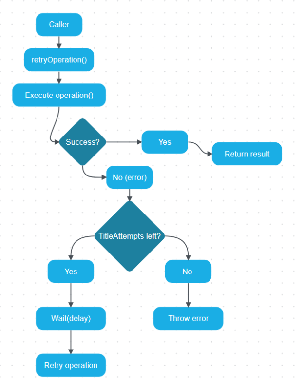

# Lab 02: Pattern Documentation & GoF Format
Student Name: Әділ Гүлсезім Date: 22.01.2026

# Task 1
1) Название паттерна: Retry with Progressive Backoff Pattern
2) Behavioral
3) Паттерн описывает алгоритм выполнение операций во времений. Он не создает новые объекты, определяет стратегию выполнения и реакции на неудачу

# Task 2
1) - Паттерн применяется когда есть асинхронные операции, которые могут временно падать. А так же когда сбой часто временный и повтор может исправить ситуацию
- Предпосылки: операция вызывается как функ operation() и возвращает Promise. Требуется обработка ошибок. 
- Ограничения среды: лимит API, чтобы не заспамить сервер. Ограничения по времени ответа

2) - Проблема: Сделать выплнение нестабильной асинхронной операции больее надежным, не ломая логику предложения, и при этом не  перегружать внешний сервер.
- Ограничения или факторы: повторы без задержик могут увеличить нагрузку, ускорить блокировку по rate-limit, ухудшить UX
- Простое решение недостаточно потому что: нестабильность 

3) Решение: 
- Обертка retryOperation выполняет операцию в цикле
- При ошибке сохроняет lastError
- Если попытка еще есть, ждет delay*attempt, затем повторяет
- Если все попытки исчерпаны, выбрасывает lastError

# Task 3
1) Преимущества: 
    - Повышает надежность при временных сбоях
    - Улучшает UX: меньше рандомных падений
    - Прогрессивная задержка снижает нагрузку

Недостатки: 
    - Увиличивает время ответа
    - Может повторять неправильные ошибки
    - При неправильной настройке может создать лишнюю нагрузку

2) Связанные паттерны
    - Decorator: Retry можно оформить как декоратор над функцией operation, добавив повведение повторов
    - Circuit Breaker: если сервис долго падает, Circuit Breaker временно прекращает попытки. Оно часто используется вместе с Retry

3) Известные применения
    - JS библиотеки: p-retry, axios-retry доют обертку вокруг Promise запросов с повторами и backoff

# Task 4
